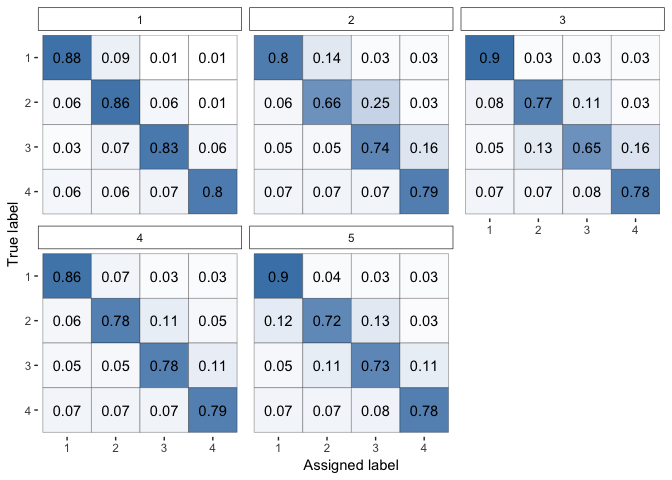

# rater 

[](https://travis-ci.com/Voltemand/rater)
[](https://codecov.io/github/Voltemand/rateR?branch=master)

**rater** provides tools for working with Bayesian models of categorical
data annotation. The pacakge provides a simple interface to fit a
selection of these models, with arbitary priors, using MCMC provided by
[Stan](https://mc-stan.org/). A selection of functions are also provided
to plot parts of these models and extract key parameters.

### Usage:

``` r
library(rater)
data(anesthesia)

fit <- mcmc(anesthesia, dawid_skene()) # sampling output suppressed

plot(fit, type = "raters")
```

<!-- -->

### Installation

**rater** requires the **rstan** package to fit models. Detialed
instructions to install **rstan** can be found
[here](https://github.com/stan-dev/rstan/wiki/RStan-Getting-Started)

To install the **rater** package run:

``` r
devtools::install_github("Voltemand/rater")
```

#### Installation notes:

  - The installation will download a yet to be released branch of the
    **rstantools** repository used to build the package
  - The **Stan** models will be compiled at install time - this will
    lead to an install time of few minutes. Please be patient - this
    complimation means that **no** complimation is required when using
    the package
  - During the compilation many warnings may be displayed in the
    terminal these are harmless but impossible to suppress.
